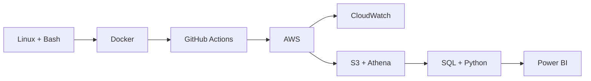

# Mohit Choudhary

  <strong>DevOps & Cloud · Data Analytics</strong> 
  Delhi NCR, India · BCA, 2026

> 💬 **Mohit:** I like turning messy systems and data into clear, reliable workflows.  
> **Currently focused on:** Linux, Docker, CI/CD, AWS, SQL, Python, and Power BI.

  
  
  

## My workflow

## GitHub snapshot

  
  

## Selected work

### Data analytics

- [Retail Customer Segmentation](https://github.com/mohitchoudhary666/Retail-Customer-Segmentation) — RFM analysis and an interactive segmentation demo. The app uses a TypeScript/Express service; the Python, PostgreSQL, and DAX materials are reference examples.
- [Customer Shopping Behavior Analysis](https://github.com/mohitchoudhary666/customer-shopping-behavior-analysis) — Python analysis, SQL examples, and Power BI dashboard.
- [Telecom Customer Churn Analysis](https://github.com/mohitchoudhary666/telecom-customer-churn-analysis) — SQL churn analysis and Power BI reporting.
- [User Behavior & Cohort Analytics](https://github.com/mohitchoudhary666/User-Behavior-Cohort-Analytics) — cohort analysis examples and dashboard prototype; no live BigQuery connection.

### Cloud and DevOps

My hands-on practice includes a Dockerized Python app with a GitHub Actions test and image-build workflow, Bash health checks for an AWS EC2 Linux server with CloudWatch monitoring, and Terraform-managed AWS networking and EC2 infrastructure.

The public [E-Commerce Analytics Pipeline](https://github.com/mohitchoudhary666/E-Commerce-Analytics-Pipeline) repository is an interactive simulator and architecture showcase; it does not deploy a live AWS pipeline.

## Experience

**Data Analyst Intern — EXCO Graphic India Pvt. Ltd.** · Jul 2025–Jan 2026

- Wrote a SQL quality-yield query that reduced defect detection from about three days to near real time.
- Consolidated Production, QA, and Logistics data into a PostgreSQL staging table.
- Contributed to weekly wastage reporting used to guide process adjustments.

## Education & certifications

- BCA, Mewar Institute of Management, CCSU (2023–2026)
- Advanced SQL — HackerRank
- Google Analytics Certification
- Data Science Essentials with Python; Data Analytics Essentials — Cisco Networking Academy

  <a href="https://www.linkedin.com/in/mohitchoudhary2004">LinkedIn</a> ·
  <a href="mailto:mohitchoudhary11012004@gmail.com">Email me</a>

