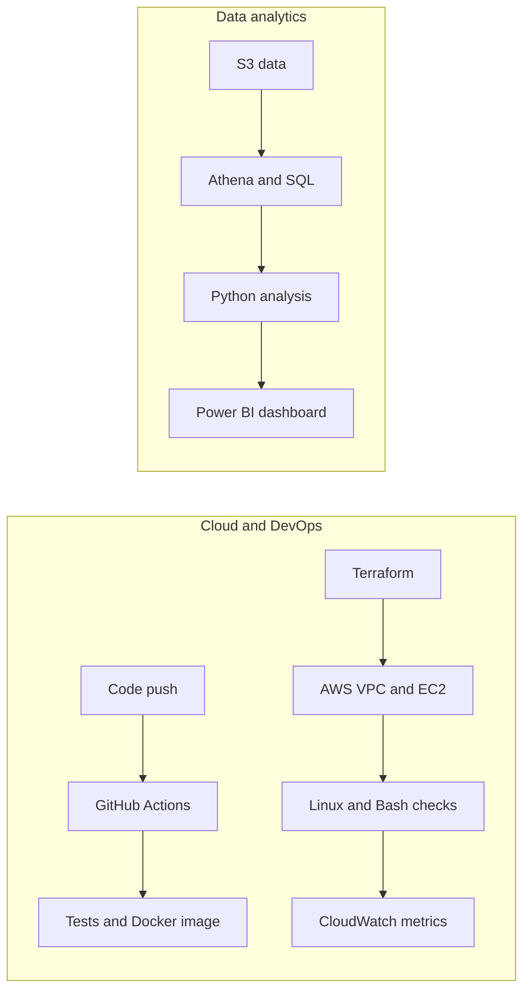

# Mohit Choudhary

  <strong>Cloud & DevOps Intern · AWS · Terraform · Linux/Bash · Docker · GitHub Actions</strong> 
  Data Analytics · SQL · Python · Power BI · Delhi NCR, India

> 💬 **Mohit:** I like turning messy systems and data into clear, reliable workflows.  
> **Currently focused on:** AWS, Terraform, EC2, CloudWatch, Linux/Bash, Docker, GitHub Actions, SQL, Python, and Power BI.  
> **Open to:** Cloud/DevOps internships, Data Analyst, and BI Analyst roles in Delhi NCR or remote.

  
  
  

## My workflow

## GitHub snapshot

  
  

## Selected work

### Data analytics

- [Retail Customer Segmentation](https://github.com/mohitchoudhary666/Retail-Customer-Segmentation) — RFM analysis and an interactive segmentation demo. The app uses a TypeScript/Express service; the Python, PostgreSQL, and DAX materials are reference examples.
- [Customer Shopping Behavior Analysis](https://github.com/mohitchoudhary666/customer-shopping-behavior-analysis) — Python analysis, SQL examples, and Power BI dashboard.
- [Telecom Customer Churn Analysis](https://github.com/mohitchoudhary666/telecom-customer-churn-analysis) — SQL churn analysis and Power BI reporting.
- [User Behavior & Cohort Analytics](https://github.com/mohitchoudhary666/User-Behavior-Cohort-Analytics) — cohort analysis examples and dashboard prototype; no live BigQuery connection.

### Cloud and DevOps

- [Dockerized Python Health API with GitHub Actions](https://github.com/mohitchoudhary666/dockerized-python-health-api) — FastAPI liveness/readiness endpoints and Prometheus metrics, non-root Docker image, Compose setup, automated tests, and CI image build.
- [AWS Infrastructure with Terraform](https://github.com/mohitchoudhary666/aws-infrastructure-terraform) — VPC, subnet, security group, IAM instance profile, and Ubuntu EC2 managed through Systems Manager, with no inbound rules.
- [AWS EC2 Server Monitoring and Health Checks](https://github.com/mohitchoudhary666/aws-ec2-server-monitoring) — Bash host metrics, systemd scheduling, a scoped CloudWatch policy, dashboard, and troubleshooting guide.

The public [E-Commerce Analytics Pipeline](https://github.com/mohitchoudhary666/E-Commerce-Analytics-Pipeline) repository is an interactive simulator and architecture showcase; it does not deploy a live AWS pipeline.

## Experience

**Business Analyst Intern — youbloom** · Apr–May 2026

- Analyzed 10,000+ fan requests across 50+ cities with SQL and Excel to identify demand patterns.
- Built Python/Pandas cleaning pipelines for 15,000+ records and reusable reporting templates.

**Data Analyst Intern — EXCO Graphic India Pvt. Ltd.** · Jul 2025–Jan 2026

- Wrote a SQL quality-yield query that reduced defect detection from about three days to near real time.
- Consolidated Production, QA, and Logistics data into a PostgreSQL staging table.
- Contributed to weekly wastage reporting used to guide process adjustments.

## Education & certifications

- BCA, Computer Science — Chaudhary Charan Singh University (2024–2026)
- Advanced SQL — HackerRank
- Google Analytics Certification
- Data Science Essentials with Python; Data Analytics Essentials — Cisco Networking Academy

  <a href="https://www.linkedin.com/in/mohitchoudhary2004">LinkedIn</a> ·
  <a href="mailto:mohitchoudhary11012004@gmail.com">Email me</a>

