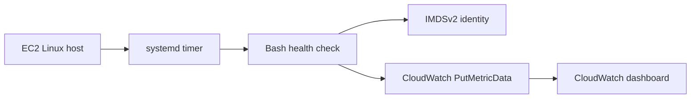

# AWS EC2 Server Monitoring and Health Checks

A Linux monitoring agent for EC2. A Bash script samples CPU, memory, root-disk usage, uptime, process count, and failed systemd units, then publishes custom metrics to Amazon CloudWatch.

This repository contains monitoring code and deployment instructions. It includes no credentials and does not claim a live deployment.

## Flow


Namespace: `Mohit/EC2Health`. Metrics: CpuUtilization, MemoryUsedPercent, RootDiskUsedPercent, UptimeSeconds, ProcessCount, and FailedSystemdUnits. Each metric is dimensioned by InstanceId and InstanceType.

## Requirements and install

- Linux with Bash, curl, awk, df, ps, systemd, and AWS CLI v2
- EC2 instance profile with the permissions in `iam/cloudwatch-put-metric-data.json`
- IMDSv2 enabled and outbound HTTPS to the regional CloudWatch endpoint

Attach the role, install AWS CLI v2, confirm the role with `aws sts get-caller-identity`, clone this repository, then run `sudo ./scripts/install.sh`. Inspect runs with `sudo journalctl -u ec2-health-check.service -n 50 --no-pager`. The installer does not create AWS resources or IAM policies.

View metrics under CloudWatch > Metrics > All metrics > `Mohit/EC2Health`. Replace REGION, INSTANCE_ID, and INSTANCE_TYPE in `cloudwatch/dashboard.json`, then create the dashboard:

```bash
aws cloudwatch put-dashboard --region YOUR_REGION --dashboard-name EC2-Health-Overview --dashboard-body file://cloudwatch/dashboard.json
```

See [docs/TROUBLESHOOTING.md](docs/TROUBLESHOOTING.md).

## Security and cleanup

The script uses IMDSv2 and an instance profile; it stores no access keys. No inbound network access is configured here. Review the IAM policy and network rules for your environment.

```bash
sudo systemctl disable --now ec2-health-check.timer
sudo rm -f /etc/systemd/system/ec2-health-check.service /etc/systemd/system/ec2-health-check.timer /usr/local/sbin/ec2-health-check.sh
sudo systemctl daemon-reload
```

MIT licensed; see [LICENSE](LICENSE).
