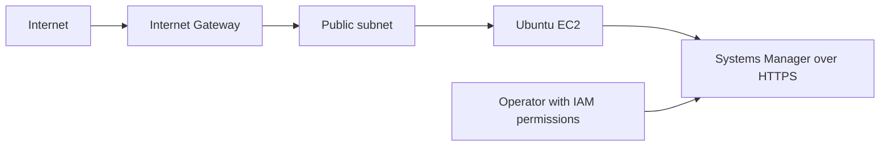

# AWS Infrastructure with Terraform

Terraform provisions a VPC, public subnet, internet gateway, security group, IAM instance profile, and Ubuntu EC2 instance. The instance has no inbound security-group rules and is administered with AWS Systems Manager Session Manager.

Reviewing this code creates no AWS resources. Running `terraform apply` creates billable resources.

## Architecture


## Security

- No inbound rules; use Session Manager instead of SSH.
- EC2 role attaches `AmazonSSMManagedInstanceCore`.
- IMDSv2 is required; hop limit is one.
- Encrypted gp3 root disk is deleted with the instance.
- Outbound DNS, HTTP, and HTTPS are allowed.
- Public IPv4 is enabled to reach public endpoints without NAT. Review networking and cost requirements before deployment.

## Requirements and deployment

Terraform >= 1.6, AWS CLI v2, and an AWS deployment identity authorized to create the resources in `main.tf`.

1. Review the Terraform files and set variables: `cp terraform.tfvars.example terraform.tfvars`.
2. Initialize and inspect:
   ```bash
   terraform init
   terraform fmt -check
   terraform validate
   terraform plan
   ```
3. Apply after reviewing the plan: `terraform apply`.
4. Connect with Session Manager using the output instance ID:
   `aws ssm start-session --target INSTANCE_ID --region YOUR_REGION`.

The operator also needs permission to start Systems Manager sessions. Never commit state, credentials, or local variable files.

## Clean up

Run `terraform destroy` and review the plan before confirming. Verify the EC2 instance, VPC, and dependent resources are removed. EC2, EBS, and public IPv4 usage may incur charges; check current AWS pricing for your region before applying.

MIT licensed; see [LICENSE](LICENSE).
